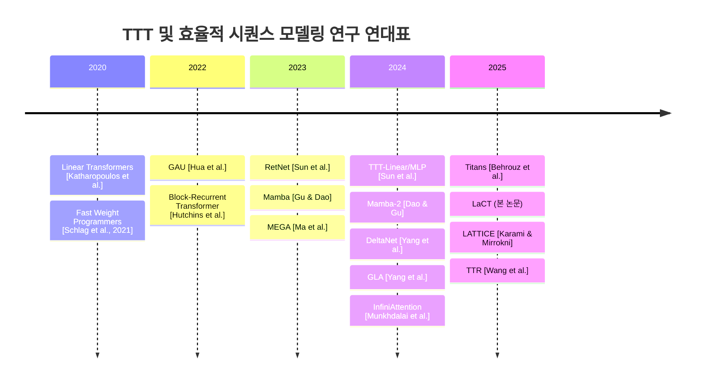

# Test-Time Training Done Right

> **논문 정보**
> - **제목**: Test-Time Training Done Right
> - **arXiv ID**: 2505.23884v1 (2025년 5월)
> - **저자**: Tianyuan Zhang 외 다수 (Adobe Research)
> - **프로젝트 웹사이트**: https://tianyuanzhang.com/projects/ttt-done-right/

---

## 1. 핵심 주장 및 주요 기여 요약

### 핵심 주장

기존 Test-Time Training(TTT) 방법들은 **작은 온라인 미니배치 크기**(16~64 토큰)로 fast weight를 업데이트하여 GPU 활용률이 5% 미만으로 극도로 낮았다. 본 논문은 이와 **정반대 방향**으로, **극단적으로 큰 청크**(2K~1M 토큰)를 사용하는 **Large Chunk Test-Time Training (LaCT)**을 제안한다. 이 접근법은:

1. **하드웨어 활용률을 수 배 이상 향상**시키고 (A100에서 최대 70%)
2. **비선형 상태(state) 크기를 모델 파라미터의 최대 40%까지 스케일링** 가능하게 하며
3. **순수 PyTorch 코드 수십 줄**로 구현 가능하여 복잡한 커스텀 커널 구현이 불필요하고
4. **Muon** 같은 고급 옵티마이저의 쉬운 통합을 지원한다.

### 주요 기여

| 기여 | 설명 |
|:---|:---|
| **대규모 청크 TTT (LaCT)** | 2K~1M 토큰의 극단적으로 큰 청크를 업데이트 단위로 사용하여 GPU 활용률을 비약적으로 향상 |
| **비선형 Fast Weight 스케일링** | SwiGLU-MLP 기반 비선형 fast weight를 채택하고, 상태 크기를 모델 파라미터의 40%까지 확장 |
| **Muon 옵티마이저 통합** | 테스트 타임 옵티마이저로 Muon을 최초로 TTT에 적용, 수치적 안정성과 성능을 동시에 개선 |
| **다양한 모달리티 검증** | NVS(이미지 셋), 언어 모델링(텍스트), 자기회귀 비디오 디퓨전(이미지 시퀀스) 세 가지 과제에서 검증 |
| **최대 1M 토큰 처리** | NVS 실험에서 100만 토큰 이상의 컨텍스트 길이를, 비디오 디퓨전에서 14B 파라미터 모델로 56K 토큰 처리 |

---

## 2. 해결하고자 하는 문제, 제안하는 방법, 모델 구조, 성능 향상 및 한계

### 2.1 해결하고자 하는 문제

#### (1) 장거리 문맥 모델링의 비효율성
Softmax attention의 계산 비용은 시퀀스 길이에 대해 **이차적( $O(N^2)$ )**으로 증가하여 장문맥 처리에 한계가 있다.

#### (2) 기존 TTT의 낮은 하드웨어 활용률
기존 TTT 방법들은 작은 미니배치 크기(16~64 토큰)로 fast weight를 업데이트하며, 이는 다음과 같은 문제를 야기한다:

- **GPU FLOPs 활용률 5% 미만**: 연산 강도(compute intensity)가 낮아 메모리 대역폭에 바운드됨
- **커스텀 커널 의존**: 효율적 구현을 위해 복잡한 CUDA 커널이 필요
- **제한된 상태 크기**: 비선형 대형 fast weight 스케일링이 어려움

논문에서 제시하는 계산 대 메모리 비율은:

$$r = \frac{2h^2 b}{2h^2 + 4hb}$$

여기서 $h$는 fast weight의 크기, $b$는 청크 크기이다. 작은 $h$(예: 64)나 작은 $b$(예: 16)에서는 $r$이 H100의 이론적 피크(290 FLOPs/byte)보다 훨씬 낮아 **메모리 바운드** 상태가 된다.

#### (3) 1D 순서 시퀀스 이외의 데이터 부적합
작은 미니배치는 세밀한 블록 단위 인과적(causal) 의존성을 가정하므로, **이미지 셋이나 비디오 같은 N차원 그리드 데이터**에는 부적합하다.

---

### 2.2 제안하는 방법 (수식 포함)

#### TTT의 기본 형식

TTT는 fast weight $W$로 매개변수화된 신경망 $f_W(\cdot): \mathbb{R}^d \to \mathbb{R}^d$를 정의하며, 두 가지 핵심 연산을 수행한다:

**업데이트(Update) 연산** — fast weight를 자기지도 손실로 갱신:

$$W \leftarrow W - \eta \nabla_W \mathcal{L}(f_W(k), v) \quad \cdots \text{(Eqn. 1)}$$

여기서 $\mathcal{L}(\cdot, \cdot)$은 변환된 키 $f_W(k)$와 값 $v$ 사이의 손실 함수(주로 MSE)이며, $\eta$는 학습률이다.

**적용(Apply) 연산** — 업데이트된 fast weight를 사용하여 출력 계산:

$$o = f_W(q) \quad \cdots \text{(Eqn. 2)}$$

#### LaCT의 대규모 청크 업데이트

기존 토큰 단위 업데이트와 달리, LaCT는 청크 내 모든 키-값 쌍에 대한 **합산 손실의 그래디언트**로 업데이트한다:

$$W \leftarrow W - \sum_{i=1}^{b} \eta_i \cdot g_i, \quad g_i = \nabla_W \mathcal{L}(f_W(k_i), v_i) \quad \cdots \text{(Eqn. 3-5)}$$

여기서 $b$는 청크 크기 (2K~1M), $\eta_i$는 각 토큰의 학습률(입력 토큰으로부터 예측), $g_i$는 fast weight 손실 함수의 그래디언트이다.

#### SwiGLU-MLP Fast Weight 네트워크

LLM에서 영감을 받아 bias 없는 **SwiGLU-MLP**를 fast weight 네트워크로 채택한다:

$$f_W(x) = W_2 \cdot (\text{SiLU}(W_1 x) \circ W_3 x) \quad \cdots \text{(Eqn. 6)}$$

여기서 $W = \{W_1, W_2, W_3\}$, $\circ$는 원소별 곱셈이다.

#### 온라인 손실 함수

단순 도트 프로덕트 손실을 사용한다:

$$\mathcal{L}(f_W(k), v) = -f_W(k)^T v \quad \cdots \text{(Eqn. 7)}$$

#### Weight 업데이트 규칙 — Vanilla Gradient Descent + Weight Normalization

$$W \leftarrow \text{WeightNorm}\left(W - \sum_{i=1}^{b} \eta_i \cdot g_i\right) \quad \cdots \text{(Eqn. 8)}$$

여기서 **L2 weight normalization**을 입력 차원을 따라 적용하며, 명시적 weight decay 없이도 그래디언트 누적의 크기 폭발이나 기억 감소 문제를 해결한다.

#### Weight 업데이트 규칙 — Muon + Weight Normalization

Muon 옵티마이저는 행렬 그래디언트의 **스펙트럼 노름을 Newton-Schulz 반복**으로 정규화한다. 그래디언트 $g = USV^T$ (SVD 분해)에 대해:

$$\text{Muon}(g) \approx UV^T \quad \cdots \text{(Eqn. 10)}$$

구체적으로 Newton-Schulz 반복은:

$$G_{k+1} = aG_k + bG_k G_k^T G_k + c G_k(G_k^T G_k)^2$$

여기서 $a = 3.4445$, $b = -4.7750$, $c = 2.0315$이며, 5회 반복을 수행한다.

전체 Muon 업데이트:

$$W \leftarrow \text{WeightNorm}\left(W - \text{Muon}\left(\sum_{i=1}^{b} \eta_i \cdot g_i\right)\right) \quad \cdots \text{(Eqn. 9)}$$

#### 상태(State) 크기 계산

head dimension을 $hd$, head 수를 $nh$, SwiGLU-MLP의 중간 차원 배율을 $r$이라 하면:

$$\text{State Size} = d \times hd \times (2r + 1) \quad \cdots \text{(Eqn. 14)}$$

여기서 $d = nh \times hd$(모델 차원). head 수를 줄이거나 중간 차원 배율 $r$을 키우면 상태 크기를 증가시킬 수 있다.

#### FLOPs 계산

$n$개 토큰에 대한 총 FLOPs:

$$\text{FLOPs} = 2 \times nh \times (2r + 1) \times 2 \times n \times hd^2 \times 3 = 12 \times d \times hd \times (2r+1) \times n \quad \cdots \text{(Eqn. 15)}$$

---

### 2.3 모델 구조

LaCT 블록은 세 가지 유형의 레이어로 구성된다:

```
┌──────────────────────────────────────┐
│         LaCT Block (반복 L회)          │
│                                      │
│  ┌──────────────────────────────┐    │
│  │  1. Window Attention Layer    │    │
│  │  (로컬 의존성 캡처)             │    │
│  │  - 양방향 or 인과적 마스크       │    │
│  └──────────────────────────────┘    │
│              ↓                       │
│  ┌──────────────────────────────┐    │
│  │  2. Large-Chunk TTT Layer     │    │
│  │  (비로컬 장거리 컨텍스트)        │    │
│  │  - Update: K,V → fast weight  │    │
│  │  - Apply: Q → output          │    │
│  └──────────────────────────────┘    │
│              ↓                       │
│  ┌──────────────────────────────┐    │
│  │  3. Feed-Forward Layer        │    │
│  │  (채널 믹싱)                    │    │
│  └──────────────────────────────┘    │
│                                      │
│  각 레이어는 잔차 연결 포함           │
└──────────────────────────────────────┘
```

#### 핵심 설계 원리

1. **하이브리드 아키텍처**: 이차 비용의 window attention(로컬 구조) + 선형 비용의 TTT(비로컬 컨텍스트)
2. **Update-Apply 순서의 유연성**: 다양한 데이터 의존성을 모델링할 수 있음
   - **Update → Apply**: 전체 어텐션과 유사 (양방향)
   - **Apply → Update**: 시프트된 블록 단위 인과적 마스크 (언어 모델링에 사용)
   - **부분 청크 Update + 전체 Apply**: 스트라이드 블록 단위 인과적 마스크 (NVS, 비디오 디퓨전에 사용)

3. **Context Parallelism**: 청크 내 토큰을 여러 디바이스에 분산하여 병렬 처리:

$$g = \sum_{j=1}^{n_{\text{shard}}} g_j$$

이는 분산 all-reduce-sum으로 구현 가능하며 DDP와 논리적으로 동일하다.

#### 태스크별 아키텍처 변형

| 태스크 | 데이터 구조 | 청크 크기 | Window Attention | TTT 마스크 |
|:---|:---|:---|:---|:---|
| **NVS** | 이미지 셋 (순서 없음) | 전체 입력 이미지 | 이미지당 양방향 | 스트라이드 블록 인과적 |
| **언어 모델링** | 1D 텍스트 시퀀스 | 2048~4096 토큰 | 슬라이딩 윈도우 인과적 | 시프트 블록 인과적 |
| **비디오 디퓨전** | 인터리브 클린/노이즈 프레임 | 프레임 청크 | 2개 프레임 청크 윈도우 | 클린 청크만 업데이트 |

---

### 2.4 성능 향상

#### Novel View Synthesis (NVS) 결과

| 설정 | LaCT | Full Attention | Perceiver | 비고 |
|:---|:---|:---|:---|:---|
| GSO 256×256 (48뷰) | **37.9 dB** (PSNR) | ~37.9 dB | ~36.5 dB | 전체 어텐션과 동등, Perceiver 대비 1.4 dB 우위 |
| GSO 512×512 (48뷰) | **35.2 dB** | ~35.2 dB | ~33.8 dB | 고해상도에서도 경쟁력 유지 |
| DL3DV 960×536 (128뷰) | **3DGS 대비 우위** | 시간/메모리 한계 | - | 100만 토큰 처리, 3D Gaussian Splatting 능가 |

- **Prefill 속도**: Full attention 대비 **~11배 빠름** (16s → 1.4s, 48뷰 기준)
- **메모리 효율**: 선형 비용( $O(N)$ )으로 128개 입력 이미지 (1M 토큰) 처리 가능

#### Language Modeling 결과

- **760M 모델**: DeltaNet+SWA, GLA+SWA와 **경쟁적 성능** 달성
  - 장문맥(32K 토큰)에서 검증 손실이 지속적으로 감소하여 **효과적 문맥 활용** 입증
  - S-NIAH(Single Needle-In-A-Haystack) 검색 정확도에서 우수한 성능
- **3B 모델**: DeltaNet+SWA 대비 **검증 손실 우위**, S-NIAH-2에서도 높은 정확도
- **핵심 관찰**: 언어 데이터는 고유 청크 구조가 없어 기본 선형 LaCT는 초기 성능이 다소 떨어지지만, **비선형 상태 + Muon**을 적용하면 per-token recurrence 베이스라인을 **유의미하게 능가**함

#### Autoregressive Video Diffusion 결과

- **1.3B 모델** (5초 비디오): 순수 SWA 대비 **디노이징 손실에서 일관된 개선**, 전체 인과적 어텐션과 동등
- **14B 모델** (8.8초, 56K 토큰): 전체 블록 인과적 어텐션과 **동등한 성능**, 더 긴 시퀀스로의 확장성 입증
- Mamba2+SWA 대비 **우수한 성능**

#### Design Choice 분석 요약

| 설계 요소 | 관찰 결과 |
|:---|:---|
| **상태 크기 스케일링** | 더 큰 상태 → 일관된 성능 향상; 긴 시퀀스일수록 격차 확대 |
| **테스트 타임 옵티마이저** | Muon > GD with Momentum > Vanilla GD |
| **비선형 vs 선형 fast weight** | 비선형(SwiGLU) > 선형, 같은 상태 크기 대비 |
| **대규모 청크 vs 토큰 단위 회귀** | NVS: 대규모 청크 우위; LM: 비선형+Muon 조합 시 우위 |

---

### 2.5 한계

> [!WARNING]
> 논문에서 저자들이 명시적으로 밝힌 한계점들입니다.

1. **회전 불변성(Rotation Invariance) 부재**
   - Softmax/Linear attention은 쿼리-키 회전에 불변하여 RoPE 같은 상대 위치 인코딩을 자연스럽게 지원하지만, SwiGLU 및 Linear fast weight는 이 성질이 없음
   - 실질적 영향은 아직 충분히 탐구되지 않음

2. **제한된 태스크 범위**
   - NVS는 포즈 정보가 주어진 3D 재구성에 한정; **포즈 없는 재구성** 같은 더 어려운 과제는 미탐구
   - 언어 모델링에서 **추론(reasoning) 능력**과 **파라미터 크기에 대한 스케일링**이 충분히 검증되지 않음 (계산 자원 한계)

3. **비디오 생성 평가 지표의 한계**
   - 언어의 perplexity나 NVS의 PSNR처럼 **신뢰할 수 있고 구분력 있는 평가 지표**가 비디오 생성 분야에 부족
   - 검증 손실만으로는 모델 스케일링의 효과를 충분히 보여주기 어려움

---

## 3. 모델의 일반화 성능 향상 가능성

### 3.1 일반화 향상의 핵심 메커니즘

#### (1) 대규모 비선형 상태를 통한 메모리 용량 확장

LaCT의 가장 중요한 일반화 메커니즘은 **비선형 fast weight의 대규모 스케일링**이다. 상태 크기를 모델 파라미터의 최대 40%까지 확장할 수 있어:

- **정보 압축 능력 향상**: 더 큰 상태는 더 많은 문맥 정보를 정확하게 인코딩
- **시퀀스 길이 증가에 따른 성능 격차 확대**: Figure 7(a)에서 **상태 크기가 클수록 긴 시퀀스에서의 이점이 더 두드러짐**을 실험적으로 확인

$$\text{State Size} = d \times hd \times (2r + 1) \leq 0.4 \times |\theta_{\text{model}}|$$

#### (2) 비선형 Fast Weight (SwiGLU-MLP)의 표현력

선형 fast weight($f_W(x) = Wx$)는 본질적으로 **연관 기억(associative memory)**의 선형 회귀에 불과하지만, SwiGLU-MLP는:

- **비선형 변환**을 통해 더 복잡한 키-값 매핑 학습 가능
- **게이팅 메커니즘**(SiLU + 원소별 곱셈)으로 정보 흐름 제어
- 실험적으로 **같거나 더 작은 상태 크기**에서도 선형 대비 우수한 성능 달성 (Figure 8a)

#### (3) Muon 옵티마이저에 의한 수치적 안정성

TTT에서 fast weight 업데이트의 핵심 문제는 **그래디언트의 반복적 누적으로 인한 크기 폭발 또는 기억 감소**이다. Muon은:

- **스펙트럼 노름 정규화**: 그래디언트의 모든 특이값을 1로 정규화 ($g \approx UV^T$)
- **학습률 민감도 감소**: $\eta_i$가 청크 내 토큰의 **상대적 중요도**만 반영하도록 함
- **장기 학습 안정성 확보**: weight normalization과 결합하여 추론 시 수백~수천 번의 업데이트에서도 안정적

#### (4) 하이브리드 아키텍처의 분업 구조

- **Window Attention**: 로컬 의존성(토큰 간 근접 관계)을 효율적으로 처리
- **TTT Layer**: 고정 크기 fast weight에 **비로컬 장거리 의존성**을 집중하여 메모리 용량을 효과적으로 활용
- 이 분업으로 TTT의 fast weight는 **중복 없이 전역 정보를 압축**하는 데 전념 가능

### 3.2 N차원 데이터로의 일반화

LaCT의 큰 청크 설계는 **다양한 차원의 데이터를 자연스럽게 처리**할 수 있다:

- **1D 시퀀스** (텍스트): 청크 크기를 하이퍼파라미터로 설정
- **2D 그리드** (이미지): 단일 이미지를 하나의 청크로 정렬
- **집합** (이미지 셋): 복수 이미지를 하나의 청크로 묶어 순서 불변(order-invariant) 처리
- **시퀀스 of 그리드** (비디오): 연속 프레임을 청크 단위로 처리

이는 기존 소형 청크 TTT에서는 불가능했던 것으로, **세밀한 블록 단위 인과적 의존성이 1D 순서 시퀀스 이외의 데이터에는 부적합**하다는 문제를 근본적으로 해결한다.

### 3.3 추론(Inference) 시 일반화

NVS 태스크에서 특히 흥미로운 관찰:
- 추론 시 LaCT layer는 **정적 가중치 레이어**로 기능하여 전체 모델이 **정적 비전 트랜스포머(ViT)**와 동일한 구조가 됨
- Fast weight의 FFN은 **장면 정보(scene information)**를 저장
- Slow weight의 FFN은 **세계 지식(world knowledge, 물리적 렌더링 규칙 등)**을 저장
- 이러한 분리가 **학습된 지식의 전이(transfer)**와 **새로운 입력에 대한 적응(adaptation)**을 동시에 가능케 함

---

## 4. 향후 연구에 미치는 영향 및 고려사항

### 4.1 향후 연구에 미치는 영향

#### (1) TTT 연구의 실용적 민주화
LaCT는 **순수 PyTorch로 수십 줄 코드**만으로 구현 가능하여, 기존에 커스텀 커널 전문성이 필요했던 TTT 연구의 진입 장벽을 크게 낮춘다. 이는 더 많은 연구자가 **fast weight 네트워크 구조, 온라인 목적 함수, 옵티마이저** 등의 설계 공간을 탐색할 수 있게 한다.

#### (2) 장문맥 모델링의 새로운 패러다임
- **선형 비용 TTT + 이차 비용 로컬 어텐션**의 하이브리드가 장문맥 모델링의 유력한 패러다임으로 자리잡을 가능성
- 100만 토큰 이상의 컨텍스트를 단일 모델로 처리할 수 있음을 실증, 이는 전체 책, 대규모 코드베이스, 장시간 비디오 등의 처리에 실질적 경로를 제시

#### (3) 다중 모달리티 통합 모델
- 세 가지 근본적으로 다른 태스크(NVS, LM, Video)에서의 검증은 **범용 장문맥 아키텍처**로서의 가능성을 시사
- Update-Apply 순서의 유연성은 **다양한 데이터 의존성 구조를 단일 프레임워크**로 처리 가능함을 보여줌

#### (4) 비디오/3D 분야에의 영향
- **자기회귀 비디오 생성**: 양방향 디퓨전 트랜스포머를 자기회귀 모델로 변환하는 실용적 방법론 제시
- **3D 재구성/렌더링**: 데이터 기반 NVS가 최적화 기반 방법(3DGS)을 능가할 수 있음을 대규모에서 최초로 입증

### 4.2 향후 연구 시 고려할 점

> [!IMPORTANT]
> 이 논문을 기반으로 후속 연구를 수행할 때 주의해야 할 핵심 사항들입니다.

#### (1) 추론(Reasoning) 능력 검증의 필요성
- 현재 LaCT의 언어 모델링 실험은 **perplexity와 검색 정확도**에 한정
- 상태 기반 모델의 알려진 약점인 **추론 능력**(수학, 코드, 논리적 추론)에 대한 체계적 평가가 필요
- 이는 충분한 학습 컴퓨팅이 전제되어야 함

#### (2) 위치 인코딩과 회전 불변성
- RoPE 같은 상대 위치 인코딩이 TTT layer에 직접 적용되지 않음
- **순서 정보가 중요한 태스크**(텍스트, 음악 등)에서 대안적 위치 인코딩 설계가 필요할 수 있음
- Window attention 브랜치에서만 RoPE를 사용하는 현재 설계의 한계와 가능성 연구 필요

#### (3) 청크 크기의 최적화
- 언어 데이터에서 청크 크기는 **하이퍼파라미터**로 설정되며, 최적값은 태스크와 데이터에 따라 다를 수 있음
- **적응적 청크 크기** 또는 **데이터 의존적 청크 분할** 전략에 대한 연구 기회
- 청크 크기와 window attention 크기의 관계(window ≥ chunk)에 대한 이론적 분석 필요

#### (4) 학습 효율성과 수렴
- Muon의 Newton-Schulz 반복(5회)에 따른 추가 계산 비용은 청크 크기가 $\frac{5}{3}hd$를 초과해야 상쇄됨
- 매우 긴 시퀀스에서의 **학습 안정성과 수렴 속도**에 대한 추가 연구 필요
- 모멘텀 구현(토큰 수준 예측 → 청크 평균)의 최적성 검증 필요

#### (5) 모델 스케일링 법칙
- 현재 실험은 최대 14B(비디오), 3B(언어)로 제한
- **수십~수백 B 파라미터 스케일**에서의 성능 추이와 스케일링 법칙 확인이 중요
- 상태 크기 대 모델 크기 비율의 최적화에 대한 체계적 연구 필요

---

## 5. 2020년 이후 관련 최신 연구 비교 분석

### 5.1 주요 관련 연구 타임라인



### 5.2 핵심 관련 연구 비교표

| 모델/방법 | 연도 | 접근법 | 상태 크기 (모델 대비) | 청크 크기 | GPU 활용률 | 커스텀 커널 | N-D 데이터 |
|:---|:---|:---|:---|:---|:---|:---|:---|
| **Mamba** | 2023 | SSM(선택적 상태 공간) | 0.1~1% | 토큰 단위 | 높음(커널) | 필요 | 제한적 |
| **Mamba-2** | 2024 | SSM + SSD | 0.1~1% | 토큰 단위 | 높음(커널) | 필요 | 제한적 |
| **GLA** | 2024 | Gated Linear Attention | 0.1~5% | 16~64 | 중간(커널) | 필요 | 제한적 |
| **DeltaNet** | 2024 | Delta Rule + Linear Attention | 0.1~5% | 16~64 | 중간(커널) | 필요 | 제한적 |
| **TTT-Linear/MLP** | 2024 | Test-Time Training | ~5% | 16~64 | <5% | 필요 | 제한적 |
| **InfiniAttention** | 2024 | 청크 어텐션 + 선형 회귀 | ~1% | 2048 | 중간 | 불필요 | 부분적 |
| **Titans** | 2025 | Neural Memory (TTT 변형) | ~5% | 토큰 단위 | 낮음 | 필요 | 제한적 |
| **LATTICE** | 2025 | 효율적 메모리 압축 TTT | ~5% | 작음 | 낮음 | 필요 | 제한적 |
| **LaCT (본 논문)** | 2025 | 대규모 청크 TTT | **≤40%** | **2K~1M** | **최대 70%** | **불필요** | **완전 지원** |

### 5.3 주요 연구와의 심층 비교

#### (1) TTT-Linear/MLP (Sun et al., 2024)

원조 TTT 논문으로, fast weight 개념을 시퀀스 모델링에 도입한 선구적 연구.

- **공통점**: fast weight를 온라인 자기지도 학습으로 갱신하는 핵심 아이디어 공유
- **차이점**:
  - TTT-Linear/MLP는 **16~64 토큰** 미니배치로 빈번하게 업데이트 → GPU 활용률 <5%
  - 작은 선형/MLP fast weight만 사용 (상태 크기 ~5%)
  - 1D 시퀀스에 특화, N-D 데이터 확장 미고려
- **LaCT의 개선**: 청크 크기를 수 배 키워 근본적으로 다른 운영점에서 작동; 비선형 대규모 상태와 Muon으로 성능과 효율 모두 개선

> **참고**: Sun, Y. et al. "Learning to (learn at test time): RNNs with expressive hidden states." arXiv:2407.04620, 2024.

#### (2) Mamba / Mamba-2 (Gu & Dao, 2023/2024)

선택적 상태 공간 모델(SSM)로, 선형 시간 시퀀스 모델링의 대표적 연구.

- **공통점**: 선형 비용으로 장문맥 모델링, 고정 크기 상태
- **차이점**:
  - Mamba는 **선형 회귀(linear recurrence)**의 결합성(associativity)을 활용한 병렬 스캔
  - 상태 크기가 매우 작아(0.1~1%) 장기 기억 용량 제한
  - 커스텀 CUDA 커널에 강하게 의존
  - **양방향 처리** 필요 시 두 방향 레이어를 별도로 적용해야 함
- **실험적 비교**: NVS에서 LaCT의 선형 대규모 청크 회귀가 동일 상태 크기의 양방향 Mamba-2를 **유의미하게 능가** (Figure 8b); 비디오 디퓨전에서도 Mamba2+SWA 대비 우수

> **참고**: Gu, A. & Dao, T. "Mamba: Linear-time sequence modeling with selective state spaces." arXiv:2312.00752, 2023; Dao, T. & Gu, A. "Transformers are SSMs." ICML, 2024.

#### (3) DeltaNet / Gated Linear Attention (Yang et al., 2024)

Delta rule을 사용한 선형 어텐션 변형으로, 토큰 단위 회귀로 상태를 업데이트.

- **공통점**: 선형 비용의 시퀀스 모델링, 상태 업데이트 메커니즘
- **차이점**:
  - Per-token recurrence를 사용하여 세밀한 인과적 의존성 모델링
  - 커스텀 커널 기반의 하드웨어 효율적 학습
  - 상태 크기가 상대적으로 작음 (0.1~5%)
- **실험적 비교**: LM에서 LaCT(3B)가 DeltaNet+SWA를 검증 손실 및 검색 정확도에서 능가; 동일 슬라이딩 윈도우 어텐션 조건에서의 공정한 비교

> **참고**: Yang, S. et al. "Parallelizing linear transformers with the delta rule over sequence length." NeurIPS, 2024; Yang, S. et al. "Gated linear attention transformers with hardware-efficient training." ICML, 2024.

#### (4) Titans (Behrouz et al., 2025)

"Neural Memory"를 테스트 타임에 학습하는 아키텍처로, TTT의 발전형.

- **공통점**: 테스트 타임에 신경망을 온라인으로 적응시키는 핵심 아이디어
- **차이점**:
  - Titans는 **토큰 단위** 또는 작은 미니배치 업데이트 고수
  - 모멘텀과 forgetting(weight decay) 메커니즘 강조
  - 하드웨어 활용률 개선에 대한 직접적 해결책 부재
- **LaCT의 차별점**: 대규모 청크로 근본적 효율성 문제 해결; weight normalization으로 명시적 weight decay 불필요; Muon 옵티마이저로 더 효과적인 비선형 업데이트

> **참고**: Behrouz, A. et al. "Titans: Learning to memorize at test time." arXiv:2501.00663, 2025.

#### (5) InfiniAttention (Munkhdalai et al., 2024)

청크 수준에서 Delta rule을 사용한 선형 회귀 업데이트를 적용하는 하이브리드 모델.

- **공통점**: 청크 어텐션 + 회귀(recurrence)의 하이브리드, 개념적으로 LaCT에 가장 가까움
- **차이점**:
  - Delta rule 기반 **선형 회귀** 업데이트로 표현력이 제한적
  - 비선형 fast weight나 Muon 같은 고급 옵티마이저 미사용
- **LaCT의 우위**: 일반적 TTT 프레임워크에서 도출된 **훨씬 더 표현력 있는 업데이트 메커니즘** 사용, 실질적 성능 향상 입증

> **참고**: Munkhdalai, T. et al. "Leave no context behind: Efficient infinite context transformers with infini-attention." arXiv:2404.07143, 2024.

#### (6) Block-Recurrent Transformer (Hutchins et al., 2022)

대규모 청크 메모리 업데이트를 탐구한 선행 연구.

- **공통점**: 대규모 청크 단위의 메모리 업데이트 아이디어
- **차이점**:
  - 메모리 토큰이 회귀 상태로 작동하며 청크 업데이트 시 셀프/크로스 어텐션 사용
  - TTT의 자기지도 학습 목적함수 미사용
- **실험적 비교**: NVS에서 유사한 Perceiver 스타일 레지스터 토큰 어텐션이 LaCT 대비 **속도와 품질 모두에서 열등**

> **참고**: Hutchins, D. et al. "Block-Recurrent Transformers." NeurIPS, 2022.

### 5.4 비교 분석 요약

LaCT는 기존 효율적 시퀀스 모델링 연구들과 비교하여 다음과 같은 **고유한 위치**를 차지한다:

1. **효율성-성능 트레이드오프의 재정의**: 커스텀 커널 없이도 높은 GPU 활용률 달성
2. **상태 용량의 비약적 확장**: 기존 방법 대비 10~100배 큰 상태-파라미터 비율
3. **모달리티 불가지론적(modality-agnostic) 설계**: 1D 텍스트부터 비순서 이미지 셋까지 통합 처리
4. **옵티마이저 설계 공간의 확장**: Muon 등 고급 옵티마이저를 TTT에 최초로 효과적 적용

---

## 참고자료

### 논문 본문에서 직접 인용된 주요 참고문헌

1. Sun, Y. et al. "Learning to (learn at test time): RNNs with expressive hidden states." arXiv:2407.04620, 2024.
2. Schlag, I., Irie, K., and Schmidhuber, J. "Linear transformers are secretly fast weight programmers." ICML, 2021.
3. Wang, K. A., Shi, J., and Fox, E. B. "Test-time regression: a unifying framework for designing sequence models with associative memory." 2025.
4. Behrouz, A. et al. "Titans: Learning to memorize at test time." arXiv:2501.00663, 2025.
5. Behrouz, A. et al. "It's all connected: A journey through test-time memorization, attentional bias, retention, and online optimization." arXiv:2504.13173, 2025.
6. Karami, M. and Mirrokni, V. "LATTICE: Learning to efficiently compress the memory." arXiv:2504.05646, 2025.
7. Jordan, K. et al. "Muon: An optimizer for hidden layers in neural networks." 2024.
8. Gu, A. and Dao, T. "Mamba: Linear-time sequence modeling with selective state spaces." arXiv:2312.00752, 2023.
9. Dao, T. and Gu, A. "Transformers are SSMs: Generalized models and efficient algorithms through structured state space duality." ICML, 2024.
10. Yang, S. et al. "Parallelizing linear transformers with the delta rule over sequence length." NeurIPS, 2024.
11. Yang, S. et al. "Gated linear attention transformers with hardware-efficient training." ICML, 2024.
12. Vaswani, A. et al. "Attention is all you need." NeurIPS, 2017.
13. Dao, T. "FlashAttention-2: Faster attention with better parallelism and work partitioning." arXiv:2307.08691, 2023.
14. Kerbl, B. et al. "3D Gaussian splatting for real-time radiance field rendering." ACM TOG, 2023.
15. Shazeer, N. "GLU variants improve transformer." arXiv:2002.05202, 2020.
16. Hua, W. et al. "Transformer quality in linear time." 2022.
17. Munkhdalai, T. et al. "Leave no context behind: Efficient infinite context transformers with infini-attention." 2024.
18. Hutchins, D. et al. "Block-Recurrent Transformers." NeurIPS, 2022.
19. Ma, X. et al. "MEGA: Moving average equipped gated attention." ICLR, 2023.
20. Ma, X. et al. "Megalodon: Efficient LLM pretraining and inference with unlimited context length." NeurIPS, 2024.
21. Sun, Y. et al. "Retentive network: A successor to transformer for large language models." arXiv:2307.08621, 2023.
22. Wang, A. et al. "Wan: Open and advanced large-scale video generative models." arXiv:2503.20314, 2025.
23. Jin, H. et al. "LVSM: A large view synthesis model with minimal 3D inductive bias." 2024.

### 외부 참고 자료

24. arXiv 원문: https://arxiv.org/abs/2505.23884
25. 프로젝트 웹사이트: https://tianyuanzhang.com/projects/ttt-done-right/

> [!NOTE]
> 이 분석 리포트는 arXiv:2505.23884v1 논문의 HTML 버전 전문과 관련 웹 검색 결과를 기반으로 작성되었습니다. 수식은 논문에 명시된 수식 번호와 함께 기재하였으며, 논문에서 직접 확인할 수 없는 내용에 대해서는 추측을 배제하고 명시적으로 확인된 사실만을 기술하였습니다.
